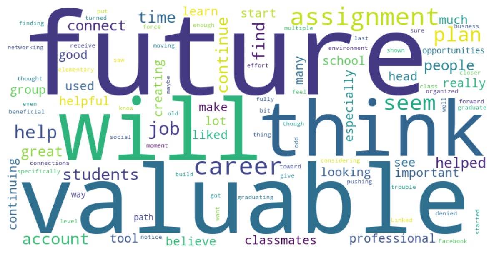

# 📈 Strategic Networking Segmentation: Maximizing Engagement on LinkedIn for University Students

## 🎯 Business Problem

Professional networking, understood as a tool for strategically building and cultivating a network of valuable contacts to generate business opportunities, support, and personal growth, has become a key element in the workplace, specifically due to branding and personal branding. In this context, social networks play a fundamental role because they help to achieve, among other benefits, reach and visibility. In the professional world, this is well known and leveraged through the quintessential social network for this purpose: LinkedIn. However, there is not much information about the perception and behavior of university students toward this social network. Given the lack of information to address this issue, a question arises: **How can we segment students based on their online behavior to predict their long-term loyalty to the platform?**. This project transforms behavioral data into **retention strategies**.

* **Objetive:** Identify user segments to personalize marketing campaigns
* **Key KPI:** Retention Rate

## 🧠 Methodology and Solution
I used a **K-Means Clustering** algorithm to group students according to their level of interaction, connections, and use of the platform.

* **Study Population:** University students who received specific training in personal branding and career visibility.
* **Data Processing:** [Pandas, NumPy, Matplotlib, Seaborn, WordCloud, Scikit-Learn].
* **Validation:** Selection of 'k' using the Silhouette Score method.

## 👥 Marketing Profiles
| Student Type| Description | Marketing Strategy |
| :--- | :--- | :--- |
| **Strategic Career Builder** |*“I use LinkedIn as a key tool to build my career”* | Mentoring - Recruitment Events |
| **Exploratory Observer** |"I know LinkedIn exists and what it's for, but I don't know how to unlock its full potential" | Professional Digital Literacy - Clear Examples of Usefulness|
| **Passive Knower** | *“LinkedIn is important, although I don’t actively use it yet”* | Practical workshops - Incentives for interaction|

## 📊 Visualizations
Wordcloud of comments from surveyed students:

Students recognize the value of LinkedIn, but only in the long term.

Feature Influence Map

The features that point in the same direction reveal:

* *First quadrant:* Students for whom exposure and visibility are more important (sometimes twice as important) than their professional development, without implying that the latter is unimportant.

* *Fourth quadrant:* Students for whom professional development is moderately important, but whose profiles do not generate visibility on the social network.

